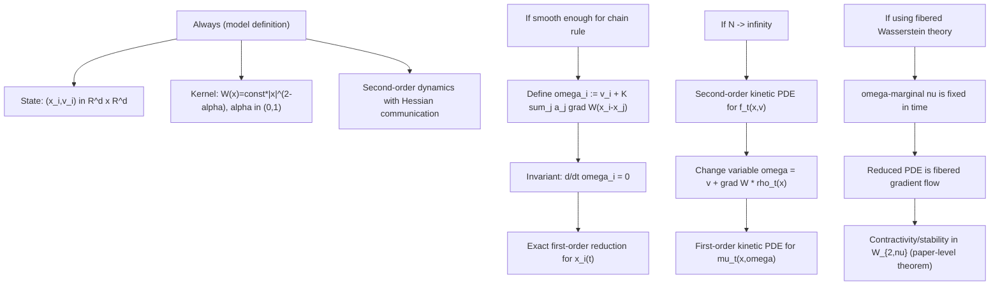

# Cucker-Smale (Hessian Communication) -> First-Order Reduction Implementation Notes

This file is the Cucker-Smale counterpart of `LMS_IMPLEMENTATION_NOTES.md`: a concrete bridge from the two papers to implementation decisions in `lmsspp`.

Primary source papers used here:

- `pitch-website/public/deixis_wiki/Notatki/PeszekPoyato/Kuramoto-type Cucker-Smale — Selected Fragments.md`
  (measure solutions + second-order/first-order equivalence)
- `pitch-website/public/papers/Heterogeneous gradient flows in the topology of fibered optimal transport.tex`
  (fibered Wasserstein gradient-flow view of the reduced model)

---

## Executive Summary (What Changes vs LMS)

- LMS: finite-dimensional Möbius reduction (`w,zeta`) on the sphere.
- Cucker-Smale here: exact variable change `v -> omega`, but still an `N`-particle position system (`x_i`) in `R^d`.
- Main simulation target should be the **first-order reduced CS system**:
  $$
  \dot x_i = \omega_i - K\sum_{j=1}^N a_j \nabla W(x_i-x_j),
  $$
  with fixed `omega_i`.
- Keep a second-order solver only as a validation harness:
  $$
  \dot x_i=v_i,\qquad
  \dot v_i = K\sum_{j=1}^N a_j D^2W(x_i-x_j)(v_j-v_i).
  $$
- Recover velocities from reduced states when needed:
  $$
  v_i(t)=\omega_i-K\sum_j a_j\nabla W(x_i(t)-x_j(t)).
  $$

---

## Assumptions Hierarchy (What Holds When)

---

## Notation + Code Conventions

- Dimension: `d`.
- Particles: `i=1,...,N`.
- Positions/velocities: `x_i(t), v_i(t) in R^d`.
- Weighted mean-field coefficients: `a_j >= 0`, `sum_j a_j = 1`.
  - Uniform case: `a_j = 1/N`.
- Coupling constant: `K > 0` (set `K=1` to match formulas without explicit coupling).
- Pairwise offset: `r_ij = x_i - x_j`, distance `|r_ij|`.

All formulas below are written in a way that maps directly to vectorized tensor code.

---

## Core Analytical Formulas You Need

### 1) Potential, Gradient, Hessian

For `alpha in (0,1)`:

$$
W(x)=\frac{1}{(2-\alpha)(1-\alpha)}|x|^{2-\alpha}.
$$

$$
\nabla W(x)=\frac{1}{1-\alpha}|x|^{-\alpha}x.
$$

For `x != 0`,

$$
D^2W(x)=\frac{1}{1-\alpha}|x|^{-\alpha}\left(I_d-\alpha\frac{x}{|x|}\otimes\frac{x}{|x|}\right).
$$

### 2) Numerically Safe Regularization

Use

$$
r_\varepsilon(x):=\sqrt{|x|^2+\varepsilon^2}.
$$

Then

$$
\nabla W_\varepsilon(x)=\frac{1}{1-\alpha}r_\varepsilon(x)^{-\alpha}x,
$$

$$
D^2W_\varepsilon(x)=\frac{1}{1-\alpha}r_\varepsilon(x)^{-\alpha}
\left(I_d-\alpha\frac{x}{r_\varepsilon(x)}\otimes\frac{x}{r_\varepsilon(x)}\right).
$$

> Practical note: in code, set diagonal (`i=j`) pair interactions to zero explicitly to avoid any ambiguity.

### 3) Efficient Hessian-Vector Product (No `dxd` Matrix Build)

For `q in R^d`, let `e=x/r`, `c=(1/(1-alpha)) r^{-alpha}`. Then:

$$
D^2W(x)\,q = c\left(q-\alpha\,e\,\langle e,q\rangle\right).
$$

This is the key `O(N^2 d)` primitive.

---

## Finite-`N` Agent Systems

### A) Second-Order CS (Validation / Reference System)

Weighted form:

$$
\dot x_i=v_i,\qquad
\dot v_i=K\sum_{j=1}^N a_j D^2W(x_i-x_j)(v_j-v_i).
$$

Uniform weights recover the paper expression with `1/N`.

### B) Exact First-Order Reduction (Main Simulation System)

Define transformed velocity:

$$
\omega_i := v_i + K\sum_{j=1}^N a_j \nabla W(x_i-x_j).
$$

Differentiate:

$$
\frac{d}{dt}\nabla W(x_i-x_j)=D^2W(x_i-x_j)(\dot x_i-\dot x_j)
=D^2W(x_i-x_j)(v_i-v_j).
$$

Hence

$$
\frac{d}{dt}\left[K\sum_j a_j \nabla W(x_i-x_j)\right]
=K\sum_j a_j D^2W(x_i-x_j)(v_i-v_j).
$$

Combine with second-order `\dot v_i`:

$$
\dot\omega_i
=K\sum_j a_j D^2W(x_i-x_j)(v_j-v_i)
+K\sum_j a_j D^2W(x_i-x_j)(v_i-v_j)
=0.
$$

So `omega_i` is constant, and dynamics reduce to:

$$
\dot x_i = \omega_i - K\sum_{j=1}^N a_j \nabla W(x_i-x_j).
$$

Velocity reconstruction:

$$
v_i(t)=\omega_i-K\sum_{j=1}^N a_j \nabla W(x_i(t)-x_j(t)).
$$

---

## Kinetic-Level Reduction (Mean-Field View)

Second-order kinetic equation (for `f_t(x,v)`):

$$
\partial_t f + v\cdot\nabla_x f + \operatorname{div}_v(F[f]f)=0,
$$

$$
F[f_t](x,v)=\int D^2W(x-x')(v'-v)f_t(x',v')\,dx'\,dv'.
$$

Set `rho_t(x)=\int f_t(x,v)\,dv`, then use

$$
\omega = v + (\nabla W*\rho_t)(x).
$$

Define pushforward transform:

$$
\mathcal{T}^{2\to 1}[\rho_t](x,v)=(x,v+\nabla W*\rho_t(x)),
\qquad \mu_t=(\mathcal{T}^{2\to 1}[\rho_t])_\#f_t.
$$

Reduced kinetic equation:

$$
\partial_t\mu + \operatorname{div}_x(u[\rho]\mu)=0,
$$

$$
u[\rho_t](x,\omega)=\omega-K(\nabla W*\rho_t)(x),
\qquad
\rho_t(x)=\int \mu_t(x,\omega)\,d\omega.
$$

No `div_omega` term implies `omega`-marginal `nu` is time-invariant.

---

## Fibered Gradient-Flow Expression Expansion

Use energy

$$
\mathcal{E}_W[\mu]
=-\int \omega\cdot x\,d\mu(x,\omega)
+\frac{K}{2}\iint W(x-x')\,d\mu(x,\omega)\,d\mu(x',\omega').
$$

First variation w.r.t. density:

$$
\frac{\delta \mathcal{E}_W}{\delta\rho}(x,\omega)
=-\omega\cdot x + K\int W(x-x')\,d\mu(x',\omega').
$$

Spatial gradient:

$$
\nabla_x\frac{\delta\mathcal{E}_W}{\delta\rho}
=-\omega+K(\nabla W*\rho)(x).
$$

So gradient-flow velocity is

$$
u=-\nabla_x\frac{\delta\mathcal{E}_W}{\delta\rho}
=\omega-K(\nabla W*\rho)(x),
$$

which matches the reduced PDE above.

---

## Direct Tensor Expansion (Implementation-Ready)

Assume:

- `X`: shape `[N,d]`
- `V`: shape `[N,d]`
- `Omega`: shape `[N,d]`
- `a`: shape `[N]`, sums to 1

Pairwise tensors:

$$
\Delta X_{ij}=x_i-x_j,\qquad
R_{ij}=\sqrt{|\Delta X_{ij}|^2+\varepsilon^2}.
$$

Regularized gradient kernel:

$$
G_{ij}
=\frac{K}{1-\alpha}R_{ij}^{-\alpha}\Delta X_{ij}.
$$

First-order force and RHS:

$$
\mathrm{Force}_i = \sum_j a_j G_{ij},
\qquad
\dot x_i = \omega_i - \mathrm{Force}_i.
$$

For second-order RHS, set

$$
\Delta V_{ij}=v_j-v_i,\qquad
E_{ij}=\Delta X_{ij}/R_{ij},
$$

$$
H_{ij}\Delta V_{ij}
=\frac{K}{1-\alpha}R_{ij}^{-\alpha}
\left(\Delta V_{ij}-\alpha E_{ij}\langle E_{ij},\Delta V_{ij}\rangle\right),
$$

$$
\dot v_i = \sum_j a_j\,(H_{ij}\Delta V_{ij}).
$$

Complexity: all core computations can be done in `O(N^2 d)` with broadcasting.

---

## Implementation Plan for `lmsspp` (Modeled After `core/lms.py`)

### Phase 1: New Core Module

Create `pitch-website/public/notebooks/kuramoto/LMSSPP/src/lmsspp/core/cucker_smale.py` with:

- `grad_w_cs(dx, alpha, eps, coupling=1.0)`
- `hess_w_times_vec(dx, dv, alpha, eps, coupling=1.0)`
- `cs_force(x, weights, alpha, eps, coupling=1.0)`
- `cs_first_order_rhs(x, omega, weights, alpha, eps, coupling=1.0)`
- `cs_reconstruct_velocity(x, omega, weights, alpha, eps, coupling=1.0)`
- `cs_second_order_rhs(x, v, weights, alpha, eps, coupling=1.0)`

### Phase 2: Integrators + Containers

Add dataclasses analogous to LMS:

- `CSFirstOrderTrajectory` (`x`, optional `v`, `omega`, `dt`, `steps`, params)
- `CSSecondOrderTrajectory` (`x`, `v`, `omega_diag`, `dt`, `steps`, params)

Integrators:

- `integrate_cs_first_order_euler(...)`
- `integrate_cs_second_order_euler(...)`

### Phase 3: Validation Utilities

Add:

- `compute_omega_invariant(x, v, weights, alpha, eps, coupling)`
- `compare_reduced_vs_second_order_cs(...)`

Diagnostics to report per-step:

- `max_i ||omega_i(t)-omega_i(0)||`
- RMS/max error between reconstructed reduced `v` and second-order `v`
- optional discrete energy drift

### Phase 4: Package Exposure

- Export from `pitch-website/public/notebooks/kuramoto/LMSSPP/src/lmsspp/core/__init__.py`.
- Keep LMS modules untouched; CS should be additive.

---

## Validation Checklist (Minimum Done Definition)

- `d=1` sanity check: model reduces to scalar weakly singular CS.
- Second-order vs reduced trajectory agreement for small `dt`.
- `omega` invariant stable in second-order solver.
- Reduced solver stable as `eps -> 0` (up to expected stiffness).
- No `nan/inf` for near-collision initial states.

---

## Common Pitfalls

- Forgetting to include the coupling `K` consistently in both dynamics and reconstruction.
- Building full Hessian matrices (`O(N^2 d^2)`) instead of Hessian-vector products.
- Using too small `eps` with too large `dt` near collisions (stiffness blow-up).
- Mixing sign convention in `omega = v + gradW*rho` vs `v = omega - gradW*rho`.
- Omitting weight normalization (`sum_j a_j = 1`) when comparing runs across `N`.
