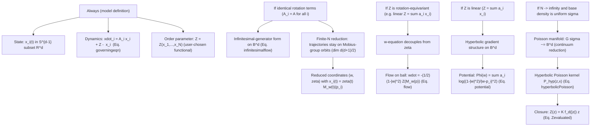

# LMS.tex -> LMSSPP Implementation Notes

This note extracts the *paper equations* from `pitch-website/public/notebooks/kuramoto/LMSSPP/papers/LMS.tex`
that are implemented in the `lmsspp` package (`pitch-website/public/notebooks/kuramoto/LMSSPP/src/lmsspp/...`).

Scope: the **real** Kuramoto-on-sphere / LMS reduction (not the complex hyperbolic even-dimensional variant).

## Assumptions Hierarchy (What Holds When)

## Variables and Conventions (As Used In Code)

- Ambient dimension `d`: usually `d=3` in widgets, but `lmsspp.core.lms` is dimension-generic.
- Particle states: `x_i(t) in S^{d-1} subset R^d`, stored as row vectors in code.
- Rotation matrices: `zeta(t) in SO(d)`; lab/body transforms use `x_lab = x_body @ zeta.T`.
- Reduced "boost" parameter: `w(t) in B^d` (Poincare ball).
- Alternative reduced center: `z(t) = - zeta(t) w(t)` (paper); in row-vector code this is `z = -(w @ zeta.T)`.
- Base points: `p_i in S^{d-1}` (constants of motion labeling the Mobius-group orbit).
- Weights: `a_i` (paper) correspond to `weights[i]` (code), typically normalized to sum to `1`.

## Implemented Equations (Paper -> Code)

### 1) Kuramoto Model on a Sphere (Finite N)

Paper Eq. `\label{governingeqn}`:

$$
\dot x_i = A_i x_i + Z - \langle Z, x_i\rangle x_i,\quad i=1,\dots,N,
$$

- `x_i`: point on the unit sphere `S^{d-1}`.
- `A_i`: antisymmetric `d x d` matrix (intrinsic rotation term).
- `Z`: order parameter vector in `R^d` (in code we focus on linear mean-field forms).

Implemented in:
- `pitch-website/public/notebooks/kuramoto/LMSSPP/src/lmsspp/core/lms.py:189` `kuramoto_sphere_vector_field`
- `pitch-website/public/notebooks/kuramoto/LMSSPP/src/lmsspp/core/lms.py:200` `kuramoto_sphere_vector_field_pairwise`
- `pitch-website/public/notebooks/kuramoto/LMSSPP/src/lmsspp/core/lms.py:623` `integrate_full_kuramoto_euler`

### 2) Hyperbolic Geometry on the Ball (Poincare Model)

Paper (Preliminaries):

$$
ds = \frac{2|dx|}{1-|x|^2}\quad (x\in B^d).
$$

Define the conformal factor:

$$
\phi(x)=\frac{2}{1-|x|^2},\quad g_{hyp}=\phi(x)^2 I.
$$

Implemented in:
- `pitch-website/public/notebooks/kuramoto/LMSSPP/src/lmsspp/core/lms.py:102` `hyperbolic_conformal_factor`

### 3) Boost (Mobius) Transformations on `B^d` and `S^{d-1}`

Paper (boost transform on `B^d`):

$$
M_w(x)=\frac{(1-|w|^2)(x-|x|^2w)}{1-2\langle w,x\rangle+|w|^2|x|^2}-w,\qquad w\in B^d.
$$

Sphere restriction (`|x|=1`):

$$
M_w(x)=\frac{(1-|w|^2)(x-w)}{|x-w|^2}-w,\qquad x\in S^{d-1}.
$$

Implemented in:
- `pitch-website/public/notebooks/kuramoto/LMSSPP/src/lmsspp/core/lms.py:46` `mobius_ball`
- `pitch-website/public/notebooks/kuramoto/LMSSPP/src/lmsspp/core/lms.py:60` `mobius_sphere`

Used for reconstruction:
- `pitch-website/public/notebooks/kuramoto/LMSSPP/src/lmsspp/core/lms.py:378` `reconstruct_points_at_frame`
- `pitch-website/public/notebooks/kuramoto/LMSSPP/src/lmsspp/core/lms.py:610` `reconstruct_sphere_trajectory`

### 4) Infinitesimal Generators on the Ball

Paper Eq. `\label{infinitesimalflow}`:

$$
\dot y = Ay - \langle Z,y\rangle y + \frac12(1+|y|^2)Z,
$$

- `A`: antisymmetric matrix.
- `Z`: vector coefficient (typically depends on the particle configuration).

Implemented in:
- `pitch-website/public/notebooks/kuramoto/LMSSPP/src/lmsspp/core/lms.py:180` `reduced_general_vector_field`

### 5) Reduced Equations (LMS Reduction) in `(w, zeta)` Coordinates

Paper Eq. `\label{wzeta}` (with `A_i` identical):

$$
\dot w = -\frac12(1-|w|^2)\,\zeta^{-1}Z,
$$

$$
\dot \zeta = \bigl(A-\alpha(\zeta w,Z)\bigr)\zeta,
$$

with the antisymmetric operator (paper definition):

$$
\alpha(y_1,y_2)\,y=\langle y_1,y\rangle y_2-\langle y_2,y\rangle y_1.
$$

Reconstruction and observables (paper text around Reduced Equations):

- `x_i(t) = zeta(t) M_{w(t)}(p_i)` (orbit parametrization by base points `p_i`)
- `z(t) = - zeta(t) w(t)` (equivalent parametrization using `z`)

Implemented in:
- `pitch-website/public/notebooks/kuramoto/LMSSPP/src/lmsspp/core/lms.py:256` `alpha_operator` (matrix form `y2 y1^T - y1 y2^T`)
- `pitch-website/public/notebooks/kuramoto/LMSSPP/src/lmsspp/core/lms.py:295` `lms_reduced_observables`
- `pitch-website/public/notebooks/kuramoto/LMSSPP/src/lmsspp/core/lms.py:329` `lms_reduced_rhs`
- `pitch-website/public/notebooks/kuramoto/LMSSPP/src/lmsspp/core/lms.py:397` `integrate_lms_reduced_euler`

Notes about the code convention:
- Code is **row-vector**: `x_lab = x_body @ zeta.T` and `z = -(w @ zeta.T)`.
- The body-frame order parameter is computed first:
  - `Z_body = K sum_i a_i M_w(p_i)`
  - `Z = Z_body @ zeta.T`

### 6) Linear Order Parameter and Decoupling of `w`

Paper Eq. `\label{orderparameter}`:

$$
Z = \sum_{i=1}^N a_i x_i.
$$

Under this form, the paper shows the `w`-equation is independent of `zeta` and reduces to:

Paper Eq. `\label{flow}`:

$$
\dot w = -\frac12(1-|w|^2)\,Z(M_w(p)).
$$

Implemented in:
- `pitch-website/public/notebooks/kuramoto/LMSSPP/src/lmsspp/core/lms.py:87` `order_parameter` (computes `sum_i a_i M_w(p_i)`)
- `pitch-website/public/notebooks/kuramoto/LMSSPP/src/lmsspp/core/lms.py:93` `lms_vector_field` (explicit `w` dynamics)
- `pitch-website/public/notebooks/kuramoto/LMSSPP/src/lmsspp/core/lms.py:329` `lms_reduced_rhs` (uses `Z_body` so `wdot` is already decoupled)

### 7) Hyperbolic Gradient Structure (Linear `Z`)

Paper (hyperbolic gradient operator):

$$
\nabla_{hyp}\Phi(w)=\frac14(1-|w|^2)^2\nabla_{euc}\Phi(w).
$$

Paper Eq. `\label{potential}` (potential for the `w`-flow):

$$
\Phi(w)=\sum_{i=1}^N a_i \log\frac{1-|w|^2}{|w-p_i|^2}
=\frac{1}{d-1}\sum_{i=1}^N a_i \log P_{hyp}(w,p_i),
$$

and (paper convention) the potential decreases along trajectories:

$$
\dot w = -\nabla_{hyp}\Phi(w).
$$

Implemented in:
- `pitch-website/public/notebooks/kuramoto/LMSSPP/src/lmsspp/core/lms.py:107` `hyperbolic_potential_lms`
- `pitch-website/public/notebooks/kuramoto/LMSSPP/src/lmsspp/core/lms.py:133` `hyperbolic_grad_from_euclidean`
- `pitch-website/public/notebooks/kuramoto/LMSSPP/src/lmsspp/core/lms.py:139` `hyperbolic_grad_autograd`
- `pitch-website/public/notebooks/kuramoto/LMSSPP/src/lmsspp/core/lms.py:160` `lms_vector_field_autograd`

### 8) Continuum Limit, Hyperbolic Poisson Kernel, and Closure `Z(z)`

Paper Eq. `\label{hyperbolicPoisson}`:

$$
P_{hyp}(z,x)=\left(\frac{1-|z|^2}{|z-x|^2}\right)^{d-1}.
$$

Paper Eq. `\label{Zz}` (continuum order parameter on the orbit of the uniform measure `sigma`):

$$
Z(z)=K\int_{S^{d-1}}M_{-z}(x)\,d\sigma(x).
$$

Paper Eq. `\label{Zevaluated}` (evaluation of the integral):

$$
Z(z)=K\,\frac{F(1,1-d/2;1+d/2;|z|^2)}{F(1,1-d/2;1+d/2;1)}\,z
=K\,f_d(|z|)\,z.
$$

Implemented in (used for widget diagnostics/overlays, not for reduced ODE integration):
- `pitch-website/public/notebooks/kuramoto/LMSSPP/src/lmsspp/lms_ball3d_widget.py:1518` `LMSBall3DWidget._shrink_fd`
  - Computes `f_d(r)` via a `2F1` series at `u=r^2` and a gamma-ratio closed form at `u=1`.

## Practical Implementation Notes (Where The Assumptions Matter)

- The reduced ODE integration in `lmsspp.core.lms` is **finite-N exact** *on a Mobius orbit* when `A_i` are identical and `Z` is of the rotation-equivariant linear mean-field form.
- The closure `Z(z)=K f_d(|z|) z` is a **continuum / Poisson-manifold** statement. In the finite-N widget we plot it as a reference curve against empirical `|Z|/K`.
- For explicit empirical-vs-reduced comparisons at finite N, use:
  - `pitch-website/public/notebooks/kuramoto/LMSSPP/src/lmsspp/core/lms.py:649` `compare_reduced_vs_full_kuramoto`
